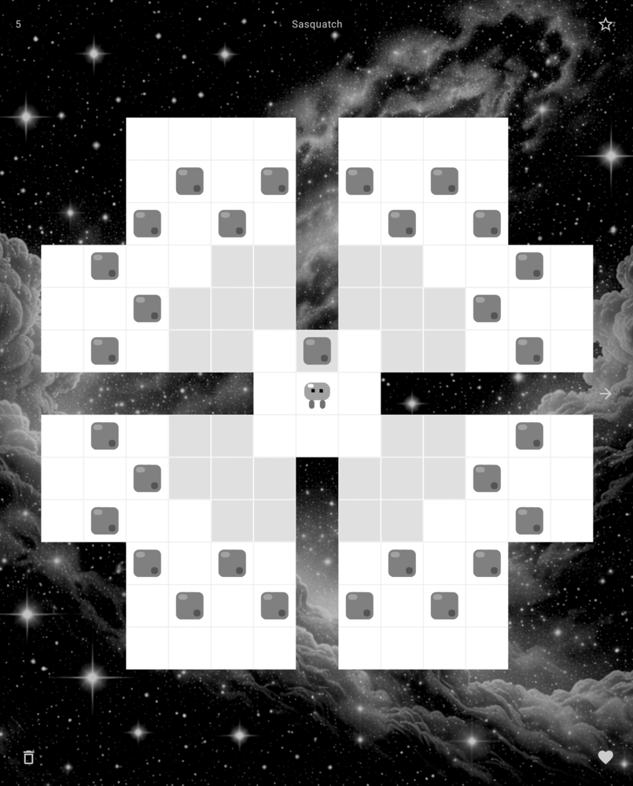
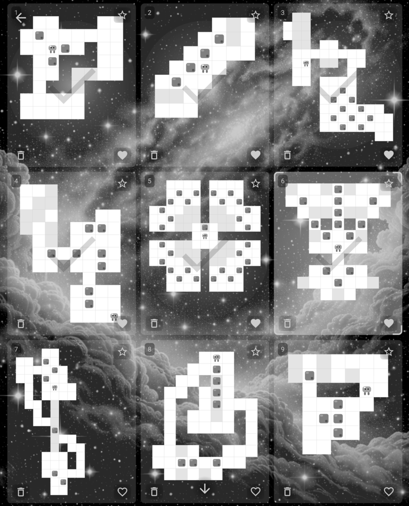

# EinkArcade

EinkArcade is the original Kotlin/Android implementation of **Sokobanitron**, a Sokoban game designed for e-ink displays.

It includes a high-contrast grayscale interface, tap-to-move pathfinding, animated box movement, local puzzle state, and level synchronization.




## Quick orientation

This implementation contains the original gameplay, rendering, animation, persistence, and synchronization work for Sokobanitron. The later Rust version moved the shared game logic into separate cross-platform crates.

The app stores synced level data and puzzle progress locally with Room. A companion `sokobrowser` server provides the initial level catalog through the sync API.

## File overview

- [`GameEngine.kt`](app/src/main/java/com/example/einkarcade/sokoban/GameEngine.kt) — game-state transitions, move validation, undo behavior, win detection, and box-removal behavior.
- [`Pathfinder.kt`](app/src/main/java/com/example/einkarcade/sokoban/Pathfinder.kt) — player reachability and tap-to-move pathfinding.
- [`BoxPathfinder.kt`](app/src/main/java/com/example/einkarcade/sokoban/BoxPathfinder.kt) — box movement planning for the tap-box-then-destination interaction model.
- [`GameBoardView.kt`](app/src/main/java/com/example/einkarcade/ui/rendering/GameBoardView.kt) — custom Android `View` for board rendering, tap-to-cell input, selection updates, viewport-aware invalidation, and animation layering.
- [`AnimationRunner.kt`](app/src/main/java/com/example/einkarcade/ui/rendering/anim/AnimationRunner.kt) — frame coordination for board animations.
- [`BoxPathAnimation.kt`](app/src/main/java/com/example/einkarcade/ui/rendering/anim/BoxPathAnimation.kt) — box movement animation.
- [`BoxVanishAnimation.kt`](app/src/main/java/com/example/einkarcade/ui/rendering/anim/BoxVanishAnimation.kt) — box-into-void animation.

## Project notes

### Level loading and sync

Level sets are selected for sync through the server, and the Android app imports those level sets into its local Room database.

A fresh install requires the sync server to be running so the app can load its initial catalog. After the first successful sync, the app can use the locally stored level data and puzzle progress.

For a standalone Android release, the server dependency should be replaced with direct level-set import or a bundled catalog.

### Design notes

EinkArcade uses a modified Sokoban board model. Traditional Sokoban levels are usually defined by walls around traversable spaces; this implementation draws floor tiles on top of a surrounding void. That creates a cleaner high-contrast shape on an e-ink display and helps maximize usable screen space.

The surrounding void is also part of the interaction model: a box can be pushed off the floor and into the void. This acts as a hidden cheat mechanic and provides another animation case for a low-refresh e-ink display.

The animation model was designed around the 20 Hz refresh behavior of the e-ink Android tablet I was targeting. The goal was not full game-engine smoothness, but clear, readable motion that worked within the display's constraints.

## Features

### Gameplay

- Tap a reachable square to move the player there automatically.
- Select a box, then tap its destination to plan and animate a valid push path.
- Push a box into the surrounding void as a hidden cheat mechanic.
- Undo moves with Android's back action, restart a changed level, or skip to the next puzzle.

### Level catalog

- Browse level sets and individual puzzles.
- Synchronize selected level sets from the companion `sokobrowser` server.
- Store the synced catalog locally after the initial import.

### Puzzle progress

- Persist puzzle metadata, completion state, ratings, starred puzzles, and best solutions locally
  with Room.
- Like, dislike, or star puzzles from inside the app.
- Send local puzzle progress back to the sync endpoint.

## Requirements

- Android Studio with Android SDK 36 installed
- JDK 11 or newer
- An Android 13+ device or emulator (API 33 is the minimum)
- The companion `sokobrowser` sync server for loading the initial level catalog

## Getting started

1. Clone the repository and open it in Android Studio.
2. Run the companion `sokobrowser` server and select the level sets that should be available to the
   Android app.
3. Set the sync server URL in `app/src/main/java/com/example/einkarcade/data/LevelsRepository.kt`.
   The checked-in value is a private-network development address:

   ```kotlin
   private const val DEFAULT_SYNC_ENDPOINT = "http://192.168.0.75:8000/api/sync"
   ```

4. Make sure the sync server is reachable from the Android device. For a server running on the
   development machine, an Android Emulator normally reaches the host through `10.0.2.2` rather than
   `localhost`.
5. Build and install the debug app:

   ```shell
   ./gradlew installDebug
   ```

   You can also select the `app` run configuration in Android Studio and click **Run**.

On first launch, the app populates its Room database from the sync endpoint. Startup fails if the
database is empty and the server is unavailable or returns no level sets. After the initial sync,
the locally stored catalog is available without bootstrapping again.

## Playing

- Tap an open board square to walk there.
- Tap a box to select it, then tap a destination to push it along a valid route.
- Use the back gesture or button to undo the last move.
- Tap the level name at the top left to choose a puzzle.
- Tap the level-set name at the top center to choose or synchronize a set.
- Use the star, heart, and dislike controls to save and rate puzzles.
- Use the side controls to restart or skip a puzzle.

## Sync API

The app sends a `POST` request to `/api/sync` with local puzzle progress:

```json
{
  "puzzles": [
    {
      "puzzle_id": 1,
      "rating": 0,
      "is_starred": false,
      "last_completed_at": null,
      "user_solution": null
    }
  ]
}
```

The server response must contain `level_sets`, `levels`, and `puzzles` arrays. The client replaces
its local catalog with the returned data while retaining the progress fields supplied by the server.

Cleartext HTTP is enabled for development. Use HTTPS and revise the Android network policy before
distributing the app.

## Development

Run the JVM unit tests:

```shell
./gradlew test
```

Run the instrumented UI tests on a connected device or running emulator:

```shell
./gradlew connectedDebugAndroidTest
```

Create debug and release builds:

```shell
./gradlew assembleDebug
./gradlew assembleRelease
```

### Testing status

The existing tests cover some core game behavior. A production version would need more systematic coverage around Android UI flows, persistence, sync failure cases, and animation edge cases.

The main implementation areas are:

- `sokoban/` — board model, movement rules, and player/box pathfinding
- `ui/` — Compose overlays plus the custom Android game-board view and animations
- `data/` — Room persistence and HTTP synchronization
- `catalog/` and `selection/` — level browsing and default-level selection

## Technology

Kotlin, Jetpack Compose, a custom Android `View` for the game board, Room, KSP, and JUnit. The build
uses Gradle 8.14.2 and Android Gradle Plugin 8.13.2.
