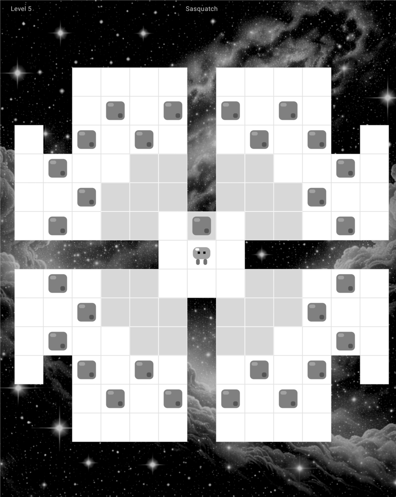
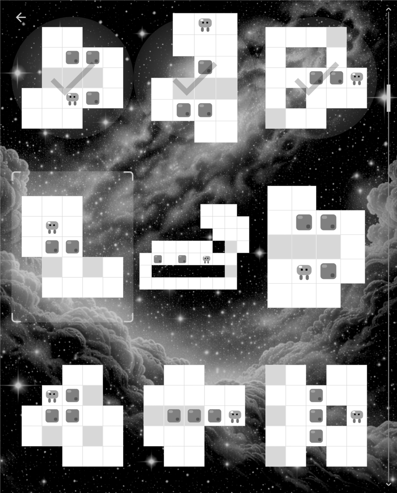

# EinkArcade

EinkArcade is the original Kotlin/Android implementation of **Sokobanitron**, a Sokoban game
designed for e-ink displays.




## Project notes

EinkArcade uses a modified Sokoban board model. Traditional Sokoban levels are usually defined by
walls around traversable spaces; this implementation draws floor tiles on top of a surrounding void.
That creates a cleaner high-contrast image on an e-ink display and helps maximize usable screen
space.

## Features

- Import level sets from SOK, SLC, and TXT files.
- Touch interface
- High-contrast UI and animations for e-ink displays

## Requirements

- Android Studio with Android SDK 36 installed
- JDK 11 or newer
- An Android 13+ device or emulator (API 33 is the minimum)

## Getting started

1. Clone the repository and open it in Android Studio.
2. Build and install the debug app:

   ```shell
   ./gradlew installDebug
   ```

   You can also select the `app` run configuration in Android Studio and click **Run**.

On first launch, the app opens the level-set picker automatically. Choose **Import**, then select a
Sokoban level-set file with a `.sok`, `.slc`, or `.txt` extension. The imported set is stored
locally.

To import another set later, tap the level-set name at the top center of the game screen and choose
**Import**.

## Playing

- Tap an open board square to move player there.
- Tap a box to select it, then tap a destination to push it along a valid route.
- Double-tap the player to restart the level.
- Double-tap the last box moved to undo that move.
- Tap the level name at the top left to choose a puzzle.
- Tap the level-set name at the top center to choose or import a set.

## Development

Run the JVM unit tests:

```shell
./gradlew test
```

Run the instrumented UI tests on a connected device or running emulator:

```shell
./gradlew connectedDebugAndroidTest
```

Create debug and release builds:

```shell
./gradlew assembleDebug
./gradlew assembleRelease
```

## Technology

Kotlin, Jetpack Compose, a custom Android `View` for the game board, Room, KSP, and JUnit.
